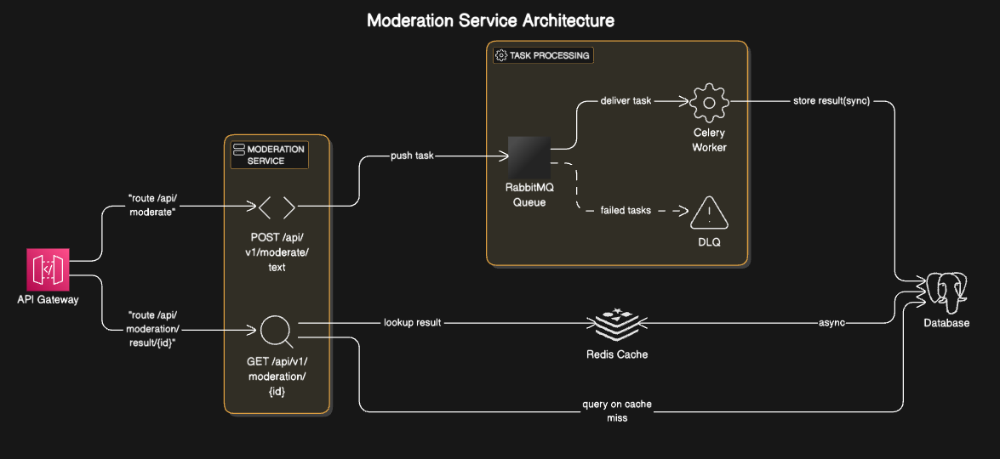
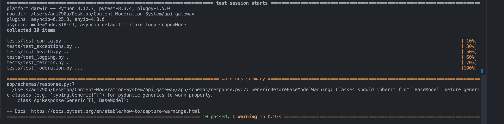
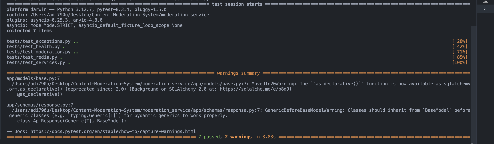
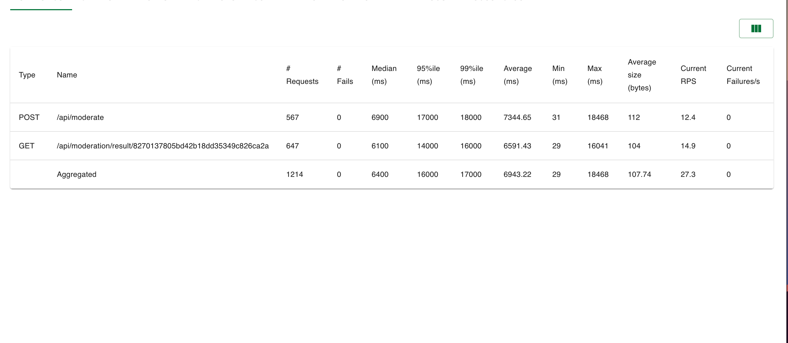

# Content Moderation System

## Overview

The Content Moderation System is a microservices-based application designed to provide automated content moderation capabilities. It consists of two main components:

1. **API Gateway**: This service acts as the entry point for all client requests, routing them to the appropriate backend services. It handles health checks, moderation requests, and metrics collection.

2. **Moderation Service**: This service processes text content and moderates user-generated content, ensuring compliance with community guidelines and legal standards.

## Table of Contents

- [Getting Started](#getting-started)
- [High Level Diagram](#high-level-diagram)
- [Setup Instructions](#setup-instructions)
- [Running the Services](#running-the-services)
- [Docker Compose](#docker-compose)
- [Prometheus](#prometheus)
- [Further Reading](#further-reading)

## Getting Started

To get started with the Content Moderation System, you will need to set up the environment variables for both the API Gateway and the Moderation Service. Each service has its own `.env.development` file that you need to configure.

## High Level Diagram

{: width="700" height="300"}

### Setup Instructions

1. **Clone the Repository**:

   ```bash
   git clone https://github.com/yourusername/Content-Moderation-System.git
   cd Content-Moderation-System
   ```

2. **Set Up Environment Variables**:
   - You can execute the command `cp ./api_gateway/.env.example ./api_gateway/.env.development && cp ./moderation_service/.env.example ./moderation_service/.env.development` to duplicate the example environment files.
   - Alternatively, navigate to the `api_gateway` directory and manually create a `.env.development` file with the required environment variables.
   - After that, repeat the process in the `moderation_service` directory to establish its `.env.development` file.
   - NOTE: The example env files are configured for docker compose based setup.

Refer to the individual `README.md` files in each service for detailed instructions on the required environment variables:

- [API Gateway README](api_gateway/README.md)
- [Moderation Service README](moderation_service/README.md)

## Running the Services

After setting up the environment variables, you can run the services individually by following the instructions in their respective `README.md` files.

## Docker Compose

For a one-command start, you can use Docker Compose to run both services together. Make sure you have Docker and Docker Compose installed on your machine.

1. Navigate to the root of the project directory:

   ```bash
   cd Content-Moderation-System
   ```

2. Run Migrations:

   ```bash
       cd moderation_service
       alembic revision --autogenerate -m "init"
       alembic upgrade head
   ```

3. Run the following command to start all services:
   ```bash
   docker compose up
   ```

This command will build and start the API Gateway, Moderation Service containers and other necessary services, allowing you to interact with the system seamlessly.

## Prometheus

Collects metrics from the API gateway and is accessible locally at http://localhost:9090.

## Test Results

### Unit Tests

1.  **API Gateway Test Results**

    {: width="600" height="200"}

2.  **Moderation Service Test Results**

    {: width="600" height="200"}

### Load Test

**Load Test Results from Locust**

- Number of Users (Peak Concurrency) = 500
- Ramp up (users started/sec) = 10
  {: width="600" height="200"}

## Further Reading

For more detailed information on each service, including their endpoints and functionalities, please refer to the following documentation:

- [API Gateway Documentation](api_gateway/README.md)
- [Moderation Service Documentation](moderation_service/README.md)
